## SDF code 实践

[SDF_test gitee code(run)](https://gitee.com/kin_zhang/sdf_test#https://gitee.com/link?target=https%3A%2F%2Fwww.cnblogs.com%2Fkin-zhang%2Fp%2F16310244.html)

[SDF explain](https://jasmcole.com/2019/10/03/signed-distance-fields/)

[【基础计算】ESDF栅格距离图计算并行加速版](https://www.cnblogs.com/kin-zhang/p/16310244.html)

## TSDF & ESDF

 欧几里得符号距离场（ESDF）可以很方便的对障碍物进行距离和梯度信息的查询

## SDF需要关注的要点

* 如何快速地生成ESDF/TSDF地图，满足motion planning频率要求
* Computation time for constructing
* Querying SDF time
* SDF是用的什么形式的地图：voxel map / elevation map

## SDF生成方法比较

SDF from elevation map > Voxblox(fast)
GIE > FIESTA > Voxblox(fast、accuracy)

## map package

[gpu-voxels git package](https://github.com/fzi-forschungszentrum-informatik/gpu-voxels)

[https://blog.csdn.net/Travis_X/article/details/115506278](https://blog.csdn.net/Travis_X/article/details/115506278)

## Pre-work: Spherical approximations of collision bodies

* decomposing the robot’s collision bodies for collision avoidance.
* 为什么要把机器人各个部分近似成球体，因为方便查询球体中心到障碍物的距离，查询的点少，高效，算力小。
* Approach:
  * 2018-ISR-Computation_of_Collision_Distance_and_Gradient_using_an_Automatic_Sphere_Approximation_of_the_Robot_Model_with_Bounded_Error

## SDF update algorithm（package）

### Voxblox

* 将传感器数据(RGBD, 点云)转换为TSDF
* 使用TSDF转化为occupancy网格
* 使用batch方法计算ESDF（根据TSDF使用 propagate的方式 更新ESDF）
* [voxblox 方法和代码理解](https://wenku.baidu.com/view/d1b3cf0e4873f242336c1eb91a37f111f1850da4.html?_wkts_=1670953839161&bdQuery=voxel+octomap)
* 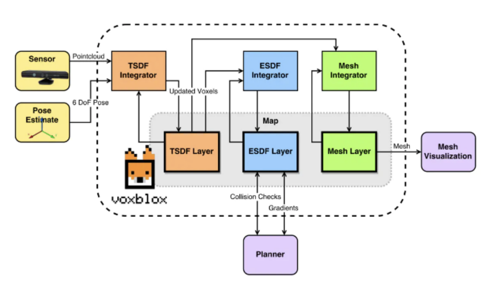

### FIESTA

* 使用光线追踪法将点云叠加到占有栅格地图中，然后将所有占用状态发生改变的体素分别添加到insertQueue和deleteQueue两个队列中
  使用一个名为ESDF更新初始化的过程，将两个队列的内容合并到updateQueue队列中，并使用基于广度优先搜索算法(BFS)的ESDF更新算法更新所有可能更改的体素。
* Run FIESTA package blog:
  * [https://blog.csdn.net/Travis_X/article/details/115506278](https://blog.csdn.net/Travis_X/article/details/115506278)
*
* 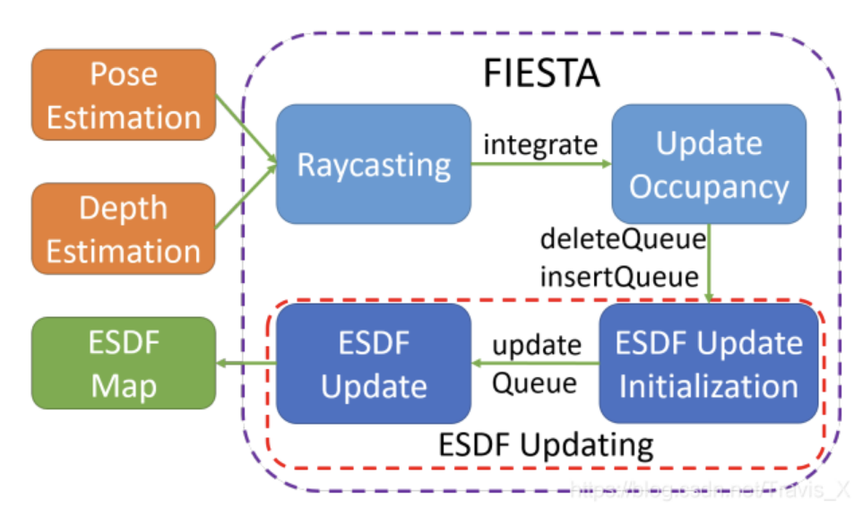

### GIE-mapping

This software is a volumetric mapping system that effectively calculates Occupancy Grid Maps (OGMs) and Euclidean Distance Transforms (EDTs) with GPU.

ref:
GPU-accelerated Incremental Euclidean Distance Transform for Online Motion Planning of Mobile Robots

## SDF from different Map structures

#### SDF from  Elevation map(2.5D)

### Package

* elevation_mapping_cupy(not yet)
* GEM(not yet)

### Paper

* Perceptive Locomotion through Nonlinear Model Predictive Control
  * SDF update frequency 20Hz
  * SDF 是从高度值算来的，把机器人近似成一个bounding box
  * MPC中的约束形式：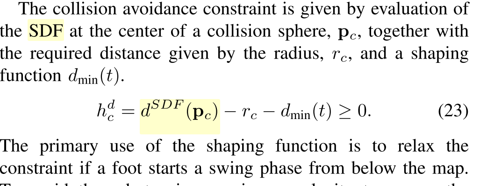
* Robust Rough-Terrain Locomotion with a Quadrupedal Robot
  * SDF build from 2.5D elevation map
  * SDF build approach:
    * 2007-IJRR-An Efficient Extension to Elevation Maps for Outdoor Terrain Mapping and Loop Closing
  * 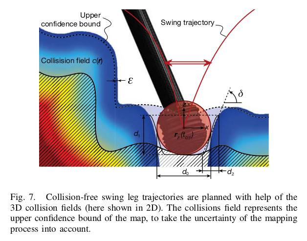
  * 用elevation map的上置信区间生成了SDF
*

#### SDF from muti-elevation-map(2.5D~3D)

* a compromise between 2.5D and 3D mapping
* 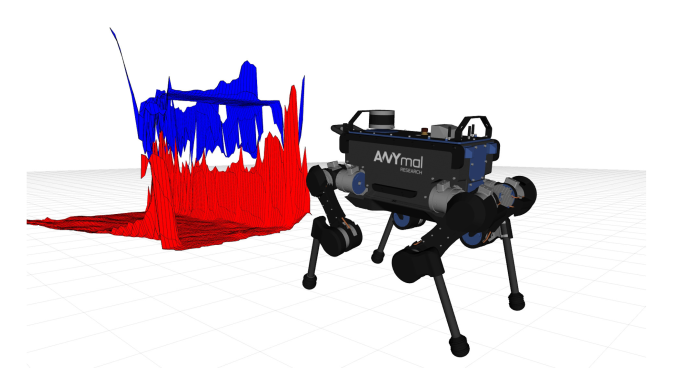
* package used: elevation_map (RAW)

***Paper***

* Walking Posture Adaptation for Legged Robot Navigation in Confined Spaces
  * a robot-centric multi-elevation map
  * 2.5D elevation map存在的问题：elevation map是把障碍物中最高的一点记录下来，如果有墙，障碍物堆满， 不适用。
  * muti-elevation-map：会把overhanging obstacle remove，这样就会使地面的建图不会被悬挂的障碍物影响。缺点，不是ceiling ，把机器人当作了一个固定高度
  * 文章做法：扩展了ETH elevation map,用grid map库，把地面估计出来，当作地板，把地板层添加进map中的一个layer，把地图从2.5D扩展成3D，再算SDF
  * SDF是怎么用进轨迹优化问题中的:CHOMP

#### SDF from 3D volumetric maps(ESDF)

***Package***

* Voxblox
* FIESTA
  * [https://www.sohu.com/a/345922274_715754](https://www.sohu.com/a/345922274_715754)
* GIE-mapping(2022-RAL)

***Paper***

* A Collision-Free MPC for Whole-Body Dynamic Locomotion and
  Manipulation
  * 球体近似方法： 2018-ISR-Computation_of_Collision_Distance_and_Gradient_using_an_Automatic_Sphere_Approximation_of_the_Robot_Model_with_Bounded_Error
  * ESDF地图构建方法：
    * FIESTA ： creates an occupancy map and uses it to compute the SDF map.
  * ESDF在优化问题中使用形式：
    * 
    * 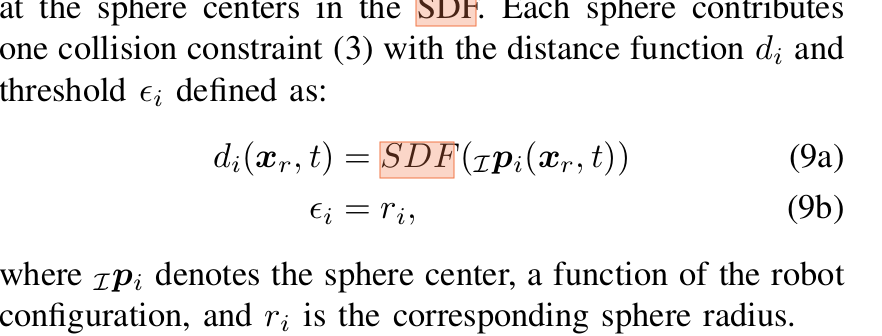

## Trajectory planning with SDF

* 2013_CHOMP_Covariant Hamiltonian optimization for motion planning
  * CHOMP has been the foundation of many motion planners
    foundation of many motion planners

## SDF from elevation map(Algorithm in TRO2022(perceptive))

### Step 1

   空间中一个点到最近障碍物的欧式平方距离：
  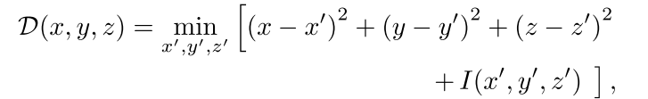
  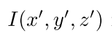：障碍物0，empty cells 无穷

### Step 2

简化计算
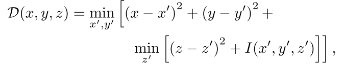

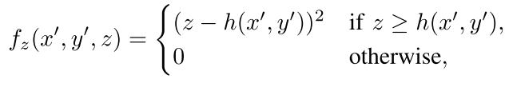
(evaluation of the elevation map)

ref:
“Distance transforms of sampled functions,”

### Step 3

STEP 2中的计算产生问题：
当前计算SDF使用的是cell 中心点的距离到障碍物中心点的距离，会导致SDF梯度不连续
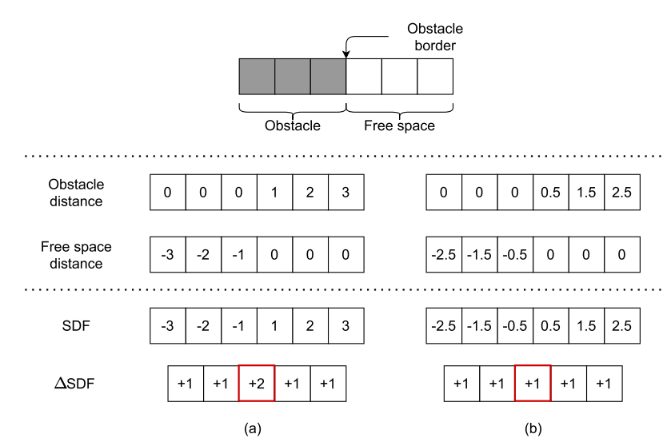

解决办法：
使用cell center到occupied /free cell边界的距离
通过调整[ref]来解决问题的离散性
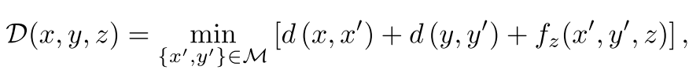
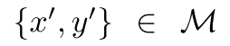: cell in local elevation map
 d(·, ·) ：a function that returns the squared distance between the center of one cell and the border of another:
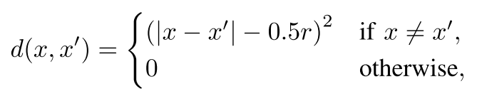
r：the resolution of the map
ref:
2017-RAS-Real-Time Motion Planning of Legged Robots: A Model Predictive Control Approach

### Step 4

compute distance transforms

ref:
A direct method for trajectory optimization of rigid bodies through contact

### Step 5

for each height in parallel

ref:
“Distance transforms of sampled functions,”
