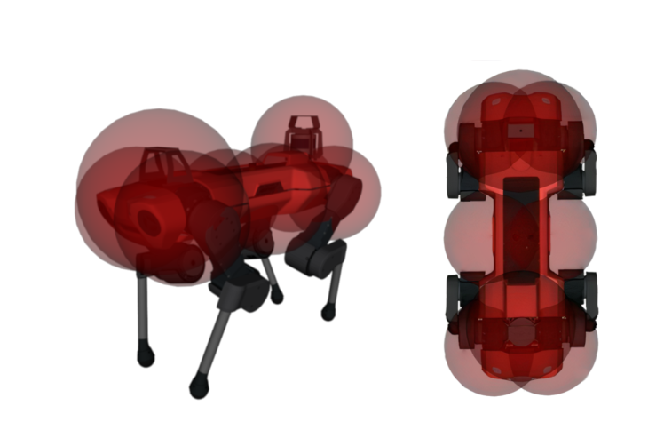
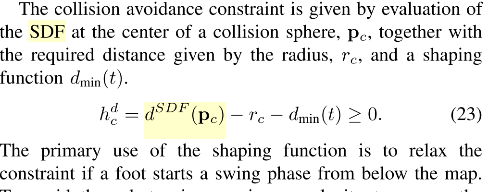

## 局部轨迹规划

## 地图

* 局部地图：
  * 作用：

    * 更新增加的静态障碍物。（√）
    * 升级：更新动态障碍物
    * 更新动态障碍物有什么难度？加入障碍物预测
  * 地图表现形式：

    * elevation map
      * 没有code，有原理，其他包的有参考代码
      * 下层模块落足点用的是elevation map，上层局部轨迹规划用elevation map其实比较合理
    * 从点云值直接更新ESDF（√）
      * FISESTA ：源码是全局ESDF，局部FISETA更新ESDF需要从另一个包里摘（TRO）（√）
      * Voxblox：ETH自家的，比FISETA慢，暂无局部ESDF更新代码
    * 更新频率：局部地图更新频率<5hz=elevation map local frequency

## 碰撞检测方法（与环境）

* 球体近似方法：（√）
  2018-ISR-Computation_of_Collision_Distance_and_Gradient_using_an_Automatic_Sphere_Approximation_of_the_Robot_Model_with_Bounded_Error
  
* MPC中的约束形式：

## 规划器

REF paper：
2021-Collision-Free MPC for Legged Robots in Static and Dynamic Scenes

* cost fun: (respect)
* constraint: (respect)

REF code:

* Perceptive_mpc

## on hand

1. local map ESDF code 摘取
2. bag播放数据（云深处二楼bag），在真值运动轨迹下，建立local ESDF map
3. MPC cost && constraint code
4. 在真值轨迹上(模仿的全局路径)，做局部轨迹

## project

误差测试接口
